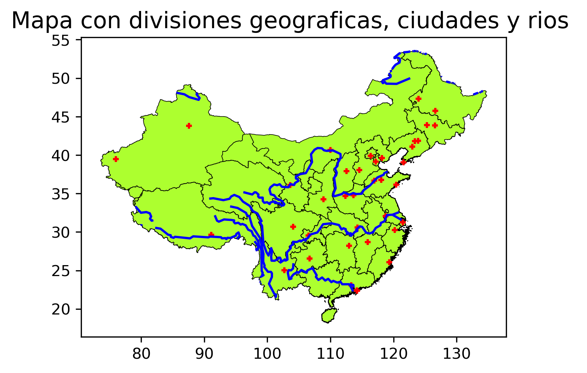

# China Spatial Data Visualization

## Contenido del Repositorio

- `data/`: Carpeta que contiene los archivos de datos utilizados en este análisis.
  - `CHN_0.shp`: Shapefile con la geometría de China a nivel nacional.
  - `CHN_1.shp`: Shapefile con las divisiones administrativas de China.
- `index.ipynb`: Notebook con el código utilizado para el análisis, visualización, y procesamiento de los datos.
- `mapa_china_provincias.png`: Mapa que muestra las provincias de China.
- `mapa_china_rios1.png`: Mapa que muestra las provincias y ríos de China.
- `mapa_china_rios2.png`: Mapa que muestra los ríos de China.
- `mapa_china_ciudades.png`: Mapa que muestra las ciudades de China.
- `mapa_china_divisiones_ciudades_rios.png`: Mapa que muestra las divisiones geográficas, ciudades y ríos de China.
- `mapa_china_centroides.png`: Mapa que muestra los centroides de las provincias de China.
- `mapa_china_aeropuertos_prov.png`: Mapa que muestra los aeropuertos de China por provincias.
- `mapa_china_aeropuertos.png`: Mapa que muestra los aeropuertos en China.
- `mapa_china_total.png`: Mapa completo que muestra ríos, provincias, ciudades, y aeropuertos en China.

## Mapas de China

### 1. Mapa de China con Provincias

### 2. Mapa de China con sus Ríos y Provincias

### 3. Mapa de China Solo con sus Ríos

### 4. Ciudades de China

### 5. Mapa con Divisiones Geográficas, Ciudades y Ríos

### 6. Mapa de China con Centroides

### 7. Aeropuertos en China

### 8. Aeropuertos en China por Provincias

### 9. Mapa de China con Ríos, Provincias, Ciudades y Aeropuertos

Link:  https://hakufer.github.io/week2_spatial/ 

## Diccionario de Datos

### Shapefiles de China
| Shapefile | Descripción |
| --- | --- |
| **CHN_0.shp** | Shapefile que contiene la geometría de China a nivel nacional. Incluye el contorno del país. |
| **CHN_1.shp** | Shapefile que contiene las divisiones administrativas de China (provincias). |

### Datos de Geografía de China
| Variable | Descripción |
| --- | --- |
| **Ríos** | Líneas que representan los ríos principales de China. |
| **Ciudades** | Puntos que indican las ubicaciones de las principales ciudades de China. |
| **Aeropuertos** | Puntos que representan los aeropuertos en China. |

### Aeropuertos
| Variable            | Descripción                                                       |
|---------------------|-------------------------------------------------------------------|
| **id**              | Identificador único del aeropuerto.                               |
| **ident**           | Código de identificación del aeropuerto (código ICAO).            |
| **type**            | Tipo de aeropuerto (e.g., "large_airport", "medium_airport").     |
| **name**            | Nombre del aeropuerto.                                            |
| **latitude_deg**    | Latitud en grados.                                                |
| **longitude_deg**   | Longitud en grados.                                               |
| **elevation_ft**    | Elevación del aeropuerto en pies.                                 |
| **continent**       | Código del continente.                                            |
| **country_name**    | Nombre del país.                                                  |
| **iso_country**     | Código ISO del país.                                              |
| **region_name**     | Nombre de la región donde se encuentra el aeropuerto.             |
| **iso_region**      | Código ISO de la región.                                          |
| **local_region**    | Región local.                                                     |
| **municipality**    | Municipio donde se encuentra el aeropuerto.                       |
| **scheduled_service** | Indica si el aeropuerto ofrece servicio programado (1 para sí, 0 para no). |
| **gps_code**        | Código GPS del aeropuerto.                                        |
| **iata_code**       | Código IATA del aeropuerto.                                       |
| **local_code**      | Código local del aeropuerto.                                      |
| **home_link**       | Enlace a la página web del aeropuerto.                            |
| **wikipedia_link**  | Enlace a la página de Wikipedia del aeropuerto.                   |
| **keywords**        | Palabras clave asociadas con el aeropuerto.                       |
| **score**           | Puntaje del aeropuerto.                                           |
| **last_updated**    | Fecha de la última actualización.                                 |
